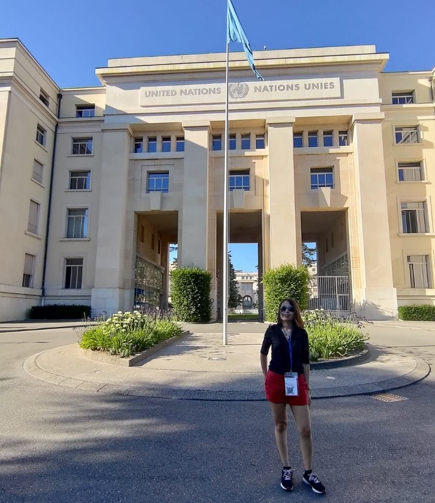

#### Work within the Peruvian Society of Bioinformatics and Computational Biology (SPBBC) initiatives 

The SPBBC is dedicated to promoting bioinformatics and training the next generation of Peruvian bioinformaticians. In 2023, I was invited to serve as Vice Director of Foreign Affairs, where I had the opportunity to present the society’s achievements during its first five years at the Peruvian Scientists in Europe Meeting 2023, held at the United Nations office in Geneva, Switzerland. 

  

In 2024, I assumed the role of Director of Foreign Affairs, representing SPBBC at various meetings across Europe and South America. One of my key initiatives has been curating a database of Peruvian bioinformaticians working abroad, laying the groundwork for a future mentoring program aimed at supporting young Peruvian students. 

Currently, I lead a team of six people, driving initiatives such as the 1st Cycle of Interviews with Peruvian Scientists Abroad and a Workshop on finding study opportunities abroad tailored for Peruvian undergraduate students. You can watch the interviews in our [youtube channel](https://www.youtube.com/@sociedadbioinfoperu)

 

#### Work within the International Society of International Biology (ISCB) associated initiatives 

I joined the ISCB Student Council in 2023, volunteering at both the Student Council Symposium (SCS2023) and the main ISCB conference. During the SCS2023, I moderated the Roundtable: "Exploring the Potential of AI in Revolutionizing Bioinformatics Research: Opportunities and Challenges". In preparation for this session, I developed the discussion questions and coordinated logistics with the panelists. The achievements of that symposium are detailed in one of my publications. 

  

In 2024, I was invited to serve as Chair of the Latin American Student Council Symposium (LA-SCS 2024). In this role, I led a team of over 20 volunteers in organizing the event, overseeing tasks such as abstract reviewing and social media outreach. During this event, I was also invited to give a talk at the CABANAnet annual meeting, where I shared my experience as Chair of LA-SCS 2024. 

I was also part of the organizing committee of the International Society for Computational Biology Student Council Symposium 2025, held in Liverpool, where I served as Head of the Finance and Fellowship Committee, leading a team of four members. Currently, I am volunteering as Head of Marketing for the ISCB-LATAM 2026 conference, to be held in Lima, where I lead a team of five members. 

 

#### Participation in mentorship programs, both as a mentee and as a mentor 

I was selected as a Mentee for the 2024 edition of the REBECA (Researchers Beyond Academia) mentoring program by Euraxess. I  also participating as a Mentee in the Extracellular Vesicles in Clinical Applications (EVCA) and the International Society for Extracellular Vesicles (ISEV) mentorship programs of 2025. 

Sharing a photo I took with my ISEV mentor 2025, Roos Vandenbroucke, when we finally got to meet in person at ISEV 2025 in Vienna!

In 2024, I took on a Mentor role in the SISAY mentorship program, a Peruvian initiative that connects Peruvian scientists with undergraduate students. I mentored a bachelor’s student from my alma mater, guiding him through the process of preparing an application for an international internship. 

In 2026, I am supervising two Master’s students in my lab. Both are working with our bariatric surgery cohort clinical database.

Additional outreach initiatives 

To date, I have delivered 20 poster and 13 oral presentations at national and international scientific conferences. 

Beyond academic conferences, I have actively participated in multiple editions of the European Researcher’s Night in Lisbon, representing my research groups at iBET, INIAV, and the Twinning Project Extracellular Vesicles in Clinical Applications (EVCA). Through these initiatives, I have contributed to making science more accessible to the general public. 