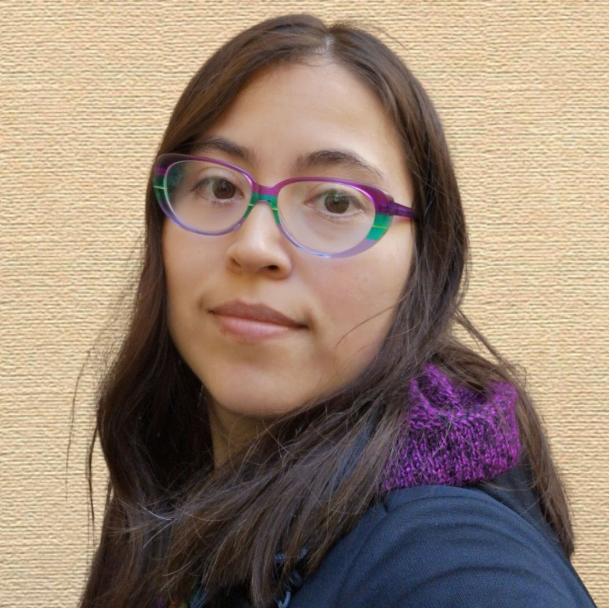

```{r, echo=FALSE, eval=FALSE}
library(htmltools)
thumbnail <- function(title, img, href, caption = TRUE) {
  div(class = "col-sm-4",
      a(class = "thumbnail", title = title, href = href,
        img(src = img),
        div(class = if (caption) "caption",
            if (caption) title)
      )
  )
}

```

<div style="display: flex; align-items: center;">

<div style="flex: 1;">
With 5 years' experience in the area of computational biology, I specialise in developing novel computational methods and bioinformatic approaches for complex omics data analysis. My work aims to uncover insights from large-scale biomedical datasets and contribute to innovative therapeutic strategies. Although I now spend most of my time in front of the computer, my previous research experience in Lima (Peru) and Lisbon (Portugal) equipped me with valuable wet-lab skills that have supported impactful, interdisciplinary research projects. I am proficient in R and Python for data analysis and software development, as well as C for low-level algorithm development.
Beyond my scientific endeavours, I am a key contributor of the International Society of Computational Biology (ISCB) Student Council and the Peruvian Society of Computational Biology (SPBBC) and have led  many of their outreach initiatives. 
</div>

<div style="flex: 0 0 auto; margin-left: 20px;">

</div>


****